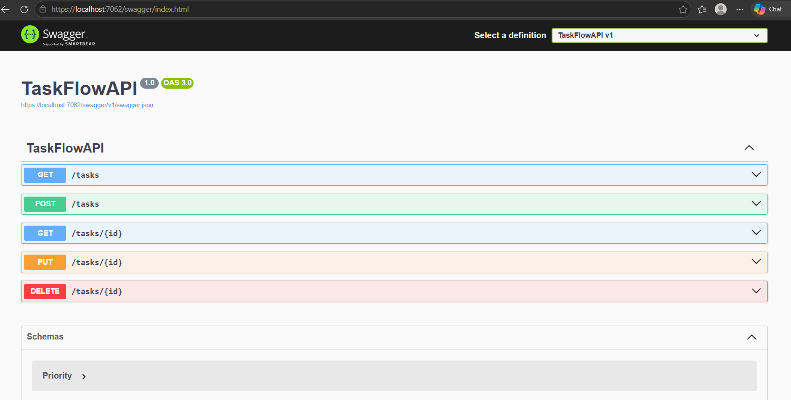
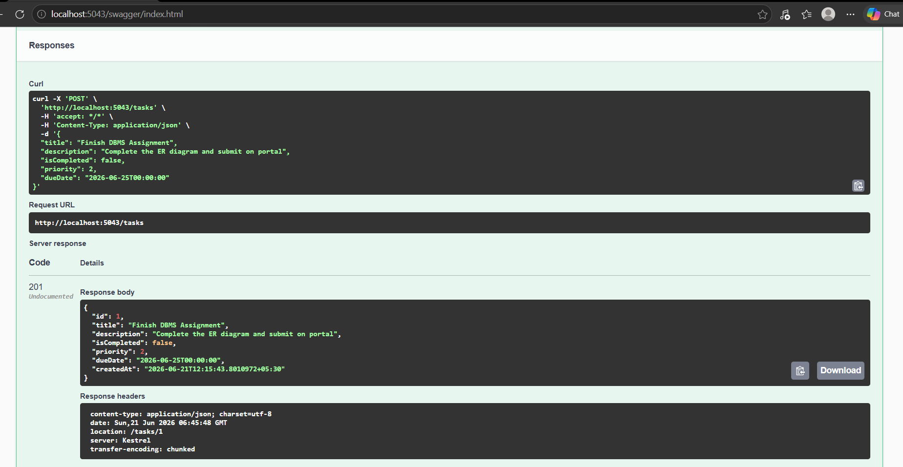

# TaskFlow API

A RESTful Task Management API built with **ASP.NET Core (C#)** and **SQL Server**, using **Entity Framework Core** for data access. TaskFlow started as a simple console application and evolved step by step into a full backend web service with database persistence.

🔗 **Repository:** https://github.com/anshika-026/Taskflow

---

## 📌 Project Overview

TaskFlow lets users create, view, update, and delete tasks (to-dos), each with a title, description, completion status, priority level, and due date. The project was built in stages — starting as a console app with JSON file storage, then progressively adding search, filtering, exception handling, and finally a full REST API backed by a real SQL Server database via Entity Framework Core.

This project demonstrates:
- RESTful API design and HTTP verb usage (GET, POST, PUT, DELETE)
- Database design and code-first migrations with Entity Framework Core
- Async/await for non-blocking database operations
- API testing and documentation via Swagger/OpenAPI

---

## 🛠️ Technologies Used

- **C# / .NET 8**
- **ASP.NET Core** (Minimal APIs)
- **Entity Framework Core** (Code-First, Migrations)
- **SQL Server / SQL Server Express**
- **Swagger / OpenAPI** for API documentation and testing
- **Git & GitHub** for version control

---

## 📡 API Endpoints

| Method | Endpoint        | Description                  |
|--------|-----------------|-------------------------------|
| GET    | `/tasks`        | Get all tasks                 |
| GET    | `/tasks/{id}`   | Get a single task by ID       |
| POST   | `/tasks`        | Create a new task             |
| PUT    | `/tasks/{id}`   | Update an existing task       |
| DELETE | `/tasks/{id}`   | Delete a task                 |

### Example request — Create a task (`POST /tasks`)

```json
{
  "title": "Finish DBMS Assignment",
  "description": "Complete the ER diagram and submit on portal",
  "isCompleted": false,
  "priority": 2,
  "dueDate": "2026-06-25T00:00:00"
}
```

### Example response

```json
{
  "id": 1,
  "title": "Finish DBMS Assignment",
  "description": "Complete the ER diagram and submit on portal",
  "isCompleted": false,
  "priority": 2,
  "dueDate": "2026-06-25T00:00:00",
  "createdAt": "2026-06-21T12:15:43.8010972+05:30"
}
```

---

## 📸 Screenshots

### Swagger UI — All Endpoints


### Example: POST request creating a task




> Replace the image files above with your own screenshots — save them in the repo root (or an `/images` folder and update the paths) so they display correctly on GitHub.

---

## ⚙️ Setup Instructions

### Prerequisites
- [.NET 8 SDK](https://dotnet.microsoft.com/download)
- SQL Server / SQL Server Express
- Visual Studio 2022 (or VS Code)

### Steps

1. **Clone the repository**
   ```bash
   git clone https://github.com/anshika-026/Taskflow.git
   cd Taskflow
   ```

2. **Update the connection string**
   Open `appsettings.json` and point the connection string to your local SQL Server instance.

3. **Apply database migrations**
   ```bash
   dotnet ef database update
   ```

4. **Run the API**
   ```bash
   dotnet run
   ```

5. **Open Swagger UI**
   Navigate to:
   ```
   http://localhost:5043/swagger
   ```
   to view and test all available endpoints.

---


- GitHub: [@anshika-026](https://github.com/anshika-026)
- LinkedIn: [Anshika Yadav](https://linkedin.com/in/anshika-yadav-24b5a9358)
